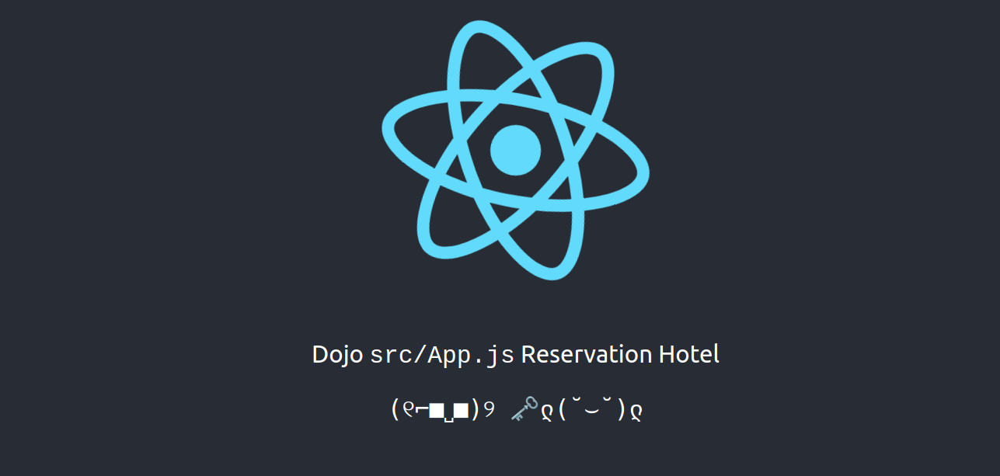

# betterAirbnb


Yosh, initial push for this project <0.0>
Will package it neatly with Docker and explain how you can run it, or test it in dev environment outside of docker.

## Quick and Dirty Installation 

**Setting up the project with Docker:**

1. Install Docker on your system. You can download Docker from the [official website](https://www.docker.com/get-started).
    
2. Clone the project repository from GitHub:
        
    `git@github.com:SolidityPracticeDojo/betterAirbnb.git`
    
3. Navigate to the project directory:
        
    `cd betterAirbnb/`
    
4. Build the Docker containers using Docker Compose:
        
    `docker-compose build`
    
5. Start the Docker containers:
        
    `docker-compose up`
    
    The mySQL application will be accessible at `http://localhost:3036`.
    
6. To stop the Docker containers, use the following command:
        
    `docker-compose down`

7. More information below on how to wipe the database and restart the application.

**Setting up the Python environment:**

1. Install `pyenv` using the installation instructions specific to your operating system. Refer to the [pyenv GitHub repository](https://github.com/pyenv/pyenv#installation) for detailed installation steps.
    
2. Open a terminal or command prompt.
    
3. Clone the project repository from GitHub:
        
    `git@github.com:SolidityPracticeDojo/betterAirbnb.git`
    
4. Navigate to the project directory:
        
    `cd betterAirbnb/`
    
5. Create a virtual environment using `pyenv`:
        
    `python -m venv env`
        
6. Activate the virtual environment:
        
    `source env/bin/activate`
    
7. Install the project dependencies:
        
    `pip install -r requirements.txt`
    
8. Run the Django development server:
        
    `python manage.py runserver`
    
    The Django application will now be accessible at `http://localhost:8000`. You can test the REST API with the following URLS: `http://localhost:8000/hotels/` or `http://localhost:8000/customers/`
    

**Setting up the React frontend:**

1. Ensure that Node.js and npm (or Yarn) are installed on your system. You can download Node.js from the [official website](https://nodejs.org/en/download/).
    
2. Open a terminal or command prompt.
    
3. Navigate to the React frontend directory within the project:
        
    `cd betterAirbnb/frontend`
    
4. Install the project dependencies using npm:
        
    `npm install`
    
    or using pnpm (better):
        
    `pnpm install`
    
5. Start the development server:
    
    `npm start`
    
    The React application will now be accessible at `http://localhost:3000`. Scroll down <0.0>

## Wipe Database and Restart

Here is custom information how to go about wiping the database in Docker and restarting the Django server.

1. Close the running database instance with `CTRL+C`
2. Close docker-compose:
`docker-compose down`
3. Find the database (optional, normally should be named in the docker-compose.yml):
`docker volume ls` 
4. Delete the database volume, or any other running instances if you like:
`docker volume rm betterairbnb__db` or `docker volume prune` (to delete all volumes).
5. You may now restart the docker instance with `docker-compose up db` or `docker-compose up` (for all instances).
6. Careful, you now need to migrate your DJANGO databases back to the docker contained mySQL instance.
`python manage.py migrate` and ` python manage.py makemigrations`. The database needs to be running for this.

Now you're good to go.
Keep in mind I edited the settings.py file in DJANGO and the docker-compose.yml to have a custom IP for the restart of the mySQL instance. Normally, when the volume gets wiped it chooses a random IP. This behavior has been modified here:
```
version: '3'
services:
  mysql:
    image: mysql
    networks:
      mynetwork:
        ipv4_address: 172.25.0.10

networks:
  mynetwork:
    ipam:
      driver: default
      config:
        - subnet: 172.25.0.0/16
```
